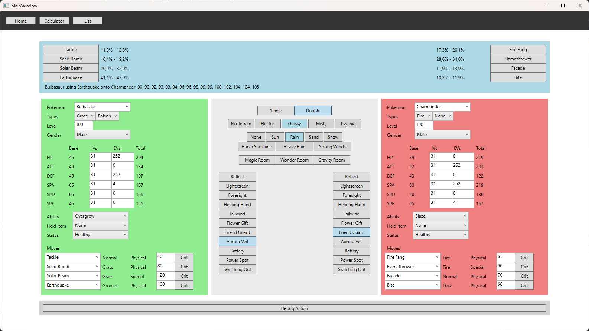

# PkmnCalculatorWPF
This is a small project to create a desktop application for a Pokémon battle calculator from the ground up using Windows Presentation Foundation and C#.

This calculator will eventually be used for my own Pokémon fangame/mod in the future.

Currently, this application is still a work in progress, though a first beta version will soon be available for download for testing purposes.

